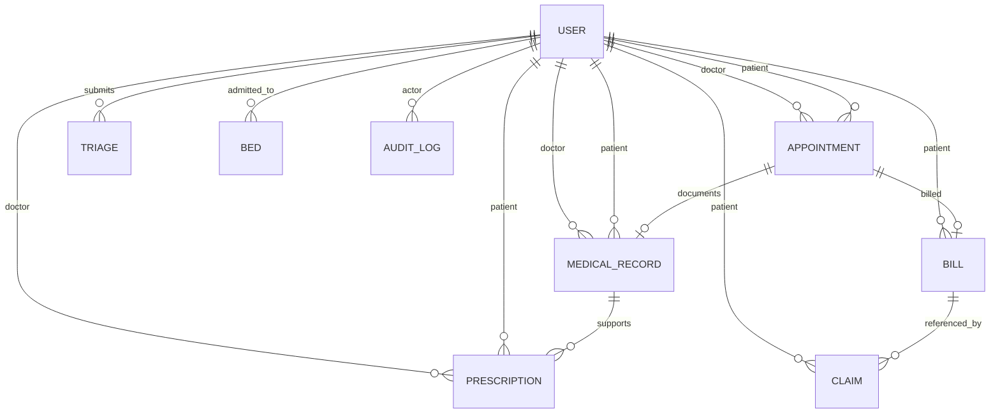

# CarePulse database design

CarePulse uses MongoDB with Mongoose models defined in `server/src/modules/models.js`. MongoDB collections are created as the application writes data; Mongoose schemas define document fields, references, validation enums, and indexes.

## Entity relationship overview

References are stored as MongoDB `ObjectId` values. The diagram shows logical associations; not every association is enforced by a database foreign-key constraint (MongoDB does not provide relational foreign keys).

## Collections

| Collection / model                 | Main data                                                                                                                           | Important relationships and rules                                                                                                                            |
| ---------------------------------- | ----------------------------------------------------------------------------------------------------------------------------------- | ------------------------------------------------------------------------------------------------------------------------------------------------------------ |
| `users` / `User`                   | Name, normalized unique email, password hash, role, department/specialty, login lockout metadata                                    | Roles are `ADMIN`, `DOCTOR`, and `PATIENT`. Password is excluded from normal query selection.                                                                |
| `appointments` / `Appointment`     | Patient, doctor, date, slot, department, status, reason, triage reference, no-show risk                                             | References patient and doctor users. Unique compound index prevents the same doctor/time slot being booked more than once for active/non-cancelled statuses. |
| `triages` / `Triage`               | Patient, private symptom text, suggested department/specialist, urgency, confidence, reasoning, disclaimer, model/fallback metadata | References a patient. Symptom text is excluded from default query selection.                                                                                 |
| `medicalrecords` / `MedicalRecord` | Patient, doctor, appointment, symptoms, diagnosis, notes, attachments                                                               | References patient, doctor, and appointment. Appointment reference is unique, allowing at most one record per appointment.                                   |
| `prescriptions` / `Prescription`   | Patient, doctor, appointment/record references, medication items, instructions, verification code, issue time                       | Verification code is unique and indexed. PDF verification endpoint returns limited verification information.                                                 |
| `bills` / `Bill`                   | Patient, appointment, line items, total, currency, payment status and paid time                                                     | Appointment reference is unique, so one bill per appointment. Payment status changes are explicitly simulated.                                               |
| `claims` / `Claim`                 | Patient, bill, provider, last four policy digits, policy hash, status, notes                                                        | References patient and bill. The full policy number is not stored; a keyed hash and last four characters are recorded.                                       |
| `beds` / `Bed`                     | Ward, bed number/type, status, patient, admission time                                                                              | Unique compound index on ward + bed number. A partial unique index prevents a patient from occupying more than one bed at once.                              |
| `auditlogs` / `AuditLog`           | Actor, action, resource, resource ID, request ID, IP, metadata, timestamp                                                           | Actor references a user when available. Events are append-style in current routes but are not stored in an externally tamper-proof system.                   |

## Indexes declared by the schemas

- `User.email`: unique.
- `User.role`: indexed.
- `Appointment.patientId`, `doctorId`, and `status`: indexed.
- `Appointment(doctorId, date, timeSlot)`: unique compound index with a partial filter that excludes cancelled bookings.
- `MedicalRecord.patientId`: indexed; `appointmentId`: unique.
- `Prescription.patientId`: indexed; `verifyCode`: unique and indexed.
- `Bill.patientId`: indexed; `appointmentId`: unique.
- `Bed.status`: indexed; `(ward, number)`: unique; `patientId`: unique only where status is `OCCUPIED`.
- `Triage.patientId`: indexed; symptom text excluded from default projections.
- `Claim.patientId`: indexed; policy hash excluded from default projections.
- `AuditLog.actorId` and `resource`: indexed.

Mongoose schemas are the source of truth for field names and index declarations. If a database was previously used with an older schema, review its existing indexes before seeding; an old unique index on a renamed field can reject current seed records. Never drop production indexes or collections without a backup and a deliberate migration plan.

## Data handling notes

- Use a separate Atlas database and least-privilege database user for the demo deployment.
- Do not use real patient information. The application is a portfolio demonstration, not a regulated medical record system.
- Seed records are synthetic. The seed script sets a public, shared demo password for its demo accounts.
- Configure database backups and retention outside this repository for any environment that needs them.
- This repository does not include a formal migration framework or an external immutable audit-log store.
